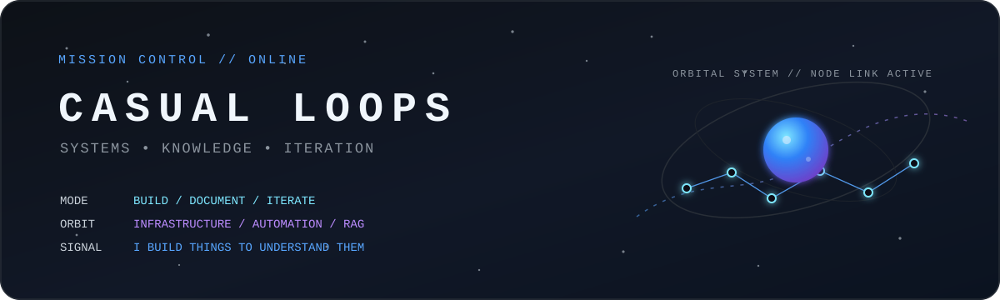

<p align="center">
  
</p>

<p align="center">
  <strong>Systems engineer and administrator building infrastructure, automation, and knowledge systems to understand how complex systems fit together.</strong>
</p>

<p align="center">
  <code>build</code> · <code>document</code> · <code>observe</code> · <code>iterate</code>
</p>

## // signal

I work across systems administration and engineering, with a focus on infrastructure, identity, automation, monitoring, and knowledge systems.

I like projects that make abstract architecture tangible. That usually means building the thing, operating it, documenting it, breaking it, fixing it, and learning what actually matters in the process.

> I build things to understand them.

## // active missions

### 01 · [homelab-infrastructure](https://github.com/casual-loops/homelab-infrastructure)

[](https://github.com/casual-loops/homelab-infrastructure/commits/main)
[](https://github.com/casual-loops/homelab-infrastructure/commits/main)
[](https://github.com/casual-loops/homelab-infrastructure/issues)

A documented private infrastructure environment used as a systems engineering laboratory.

`Proxmox` `Linux` `Docker` `Networking` `TLS` `Tailscale` `Checkmk` `Prometheus` `Grafana` `Backups`

Current work centers on service architecture, observability, secure access, reverse proxy design, recovery, and infrastructure documentation.

### 02 · [knowledge-vault-rag](https://github.com/casual-loops/knowledge-vault-rag)

[](https://github.com/casual-loops/knowledge-vault-rag/commits/main)
[](https://github.com/casual-loops/knowledge-vault-rag/commits/main)
[](https://github.com/casual-loops/knowledge-vault-rag/issues)

A private-first personal knowledge assistant built to understand retrieval-augmented generation from the ground up.

`Python` `FastAPI` `PostgreSQL` `pgvector` `Docker` `Obsidian`

The project connects two interests I keep returning to: systems engineering and knowledge management.

### 03 · [esm-sql-analytics](https://github.com/casual-loops/esm-sql-analytics)

[](https://github.com/casual-loops/esm-sql-analytics/commits/main)
[](https://github.com/casual-loops/esm-sql-analytics/commits/main)
[](https://github.com/casual-loops/esm-sql-analytics/issues)

Practical SQL analysis focused on answering operational data questions with reproducible queries and documentation.

`SQL` `Analytics` `Data`

## // telemetry

| Vector | Status |
| --- | --- |
| Linux | operating |
| Python | building |
| PowerShell | deepening |
| Cloud | expanding |
| Identity | engineering |
| RAG | experimenting |
| Automation | always |
| Knowledge management | forever |

## // systems

```text
INFRASTRUCTURE   Linux · Proxmox · Docker · Nginx · Tailscale
OBSERVABILITY    Checkmk · Prometheus · Grafana
DATA             PostgreSQL · pgvector · SQL
ENGINEERING      Python · PowerShell · Git · FastAPI
IDENTITY         IAM · SSO · Google Workspace · Entra ID
KNOWLEDGE        Obsidian · RAG · Documentation
```

## // trajectory

```text
CURRENT VECTOR

→ deeper Linux administration
→ Python for systems engineering
→ PowerShell beyond task automation
→ cloud and identity architecture
→ retrieval-augmented generation
→ infrastructure automation
```

## // operating principles

```text
01  Prefer evidence over assumptions.
02  Automate repeatable work, document the edge cases.
03  Monitoring should explain a system, not merely report that it exists.
04  Good infrastructure is understandable infrastructure.
05  The fastest way to learn a system is often to own its failure modes.
```

## // off orbit

When I am not working on infrastructure or automation, I keep circling back to astronomy, mathematics, and writing.

I also enjoy taking my dog, Marvel, on adventures at nearby parks, trails, and lakes.

## // comms

If you are here because of one of the projects above, open an issue in the relevant repository. I am always interested in comparing implementation choices, operational lessons, and better ways to design the system.

<p align="center">
  <sub>casual-loops // systems · knowledge · iteration</sub>
</p>
